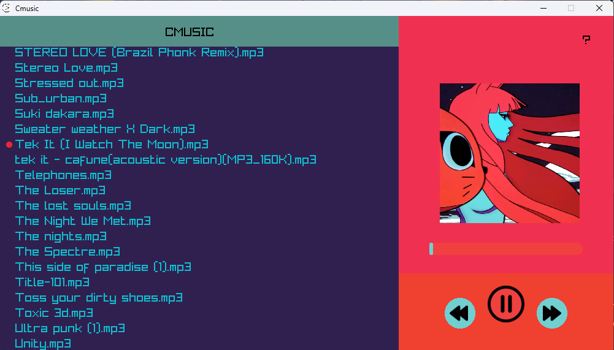

# Idea 1

## New UI

now cmusic is the mirror of my cmusicplayer app, i was just rebasing it with git, but to be honest now that i was looking in the design it's bad as fuc man like it looks like this

now i went and checked some musicplayer design and this?

[Source](https://dribbble.com/shots/19753283-Web-Music-Player-Concept).

it looks sick man, i know it is a dumb idea to make it in c but why not let's give it a shot
